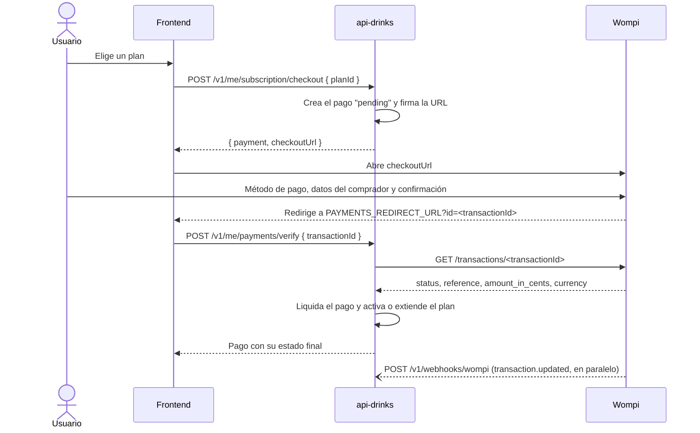

# Pagos con Wompi: guía para desarrolladores

Cómo se paga una suscripción en api-drinks, pantalla por pantalla, y cómo probarlo en el sandbox.
El resumen de los endpoints está en el README, en *Pagos (Wompi)*.

## Piezas

- **Wompi Web Checkout.** La página de pago la aloja Wompi, así que la API nunca ve datos de
  tarjetas ni de cuentas bancarias. Solo arma una URL firmada y después consulta el resultado.
- **Puerto `PaymentGateway`** (`src/billing/application/ports`) y su adaptador `WompiGateway`
  (`src/billing/infrastructure/wompi`). Otra pasarela sería otro adaptador.
- **Tabla `payments`.** Cada intento de pago es una fila con una referencia única
  `drinks-<uuid>` que viaja a Wompi y vuelve con la transacción.

## El flujo completo



Hay dos caminos para confirmar el pago, y se usan los dos:

- **La verificación del frontend** (`POST /v1/me/payments/verify`) da una respuesta inmediata al
  usuario.
- **El webhook** (`POST /v1/webhooks/wompi`) cubre al usuario que cierra la pestaña antes de volver.

La API liquida cada pago **una sola vez**, así que no importa cuál llegue primero ni si Wompi
reintenta el evento.

### 1. La API crea el checkout

`POST /v1/me/subscription/checkout` con `{ "planId": "pro" }` y el Bearer del usuario:

- guarda un pago `pending` con el precio del plan en la tabla `plans`, que es la única fuente del
  precio;
- firma la integridad: `SHA256(referencia + monto_en_centavos + moneda + WOMPI_INTEGRITY_SECRET)`.
  Así nadie puede cambiar el monto en la URL;
- devuelve `checkoutUrl` con `public-key`, `currency`, `amount-in-cents`, `reference`,
  `signature:integrity`, `redirect-url` y `customer-data:email`.

### 2. Pantallas de Wompi

Todas llevan la franja **MODO DE PRUEBAS** cuando se usan las llaves `pub_test_…`.

| URL | Qué se ve | Qué hacer en sandbox |
| --- | --------- | -------------------- |
| `checkout.wompi.co/p/?…` | Enlace de entrada. Wompi valida la firma y redirige | — |
| `checkout.wompi.co/method` | "¿Cómo quieres pagar?": el monto ($89.000) y los métodos: tarjeta débito o crédito, Nequi, DaviPlata, QR, transferencia Bancolombia, PSE, efectivo… | Elegir un método |
| `checkout.wompi.co/customer_data` | Datos del comprador: nombre, correo (viene lleno con el del usuario) y celular | Cualquier dato con formato válido |
| `checkout.wompi.co/pse` | Solo con PSE: banco, tipo y número de documento, y los términos | Elegir el banco de pruebas y el resultado: **aprueba**, **declina** o **simula error** |
| Pantalla de tarjeta | Con tarjeta: número, vencimiento, CVC, nombre, documento y cuotas | Ver *Datos de prueba* |
| Resultado | "¡Pago aprobado!" (o rechazado) con el número de transacción, la referencia `drinks-…`, el método y el comprador. Wompi envía el comprobante al correo registrado en su cuenta de comercio | **Volver al comercio** |

**Volver al comercio** lleva a `PAYMENTS_REDIRECT_URL?id=<transactionId>&env=test` (`env=test`
solo en sandbox). El `id` es el
número de transacción de la pantalla de resultado, por ejemplo `12199767-1790317408-25336`.

### 3. El frontend confirma

La página de retorno, por ejemplo `/pago/resultado`, lee `id` de la URL y llama:

```http
POST /v1/me/payments/verify
Authorization: Bearer <accessToken>
Content-Type: application/json

{ "transactionId": "12199767-1790317408-25336" }
```

La respuesta es el pago con su estado:

| `status` | Significa | Qué mostrar |
| -------- | --------- | ----------- |
| `approved` | Pagado; el plan quedó activo o extendido | Éxito y el plan nuevo (`GET /v1/me/subscription`) |
| `pending` | El banco aún no responde (pasa con PSE) | "Procesando…", y volver a verificar cada pocos segundos |
| `declined` | Rechazado por el banco o la tarjeta | Ofrecer intentar de nuevo con un checkout nuevo |
| `voided` / `error` | Anulado o falló | Igual que `declined` |

## Reglas que aplica la API

- **Precio desde la base:** el monto sale de `plans`, nunca del cliente.
- **Monto o moneda distintos:** si Wompi reporta otro monto u otra moneda, el pago queda en `error`
  y no activa nada.
- **Solo el dueño:** verificar el pago de otro usuario responde `403 FORBIDDEN`.
- **Idempotente:** un pago en estado final (`approved`, `declined`, `voided`, `error`) no cambia más.
  Verificarlo otra vez devuelve lo mismo y no extiende el plan de nuevo.
- **Periodo:** un pago aprobado activa el plan por `SUBSCRIPTION_PERIOD_DAYS` (30). Si se renueva el
  mismo plan mientras sigue vigente, el periodo se suma al final; si es otro plan, empieza hoy.
- **Checkout abandonado:** si el usuario no paga, su pago queda `pending` para siempre en el
  historial (`GET /v1/me/payments`). No activa nada ni molesta: cada intento crea un pago nuevo.
- **Webhook firmado:** el checksum de cada evento se comprueba con `WOMPI_EVENTS_SECRET` (SHA-256 de
  las propiedades listadas en `signature.properties`, el `timestamp` y el secreto). Si no coincide,
  la API responde `401 INVALID_WEBHOOK_SIGNATURE`.

## Configuración

En Wompi, activa el **modo de pruebas** y ve a **Desarrolladores → Programadores**:

| En Wompi | Variable | Nota |
| -------- | -------- | ---- |
| Llave pública `pub_test_…` | `WOMPI_PUBLIC_KEY` | Va en la URL del checkout |
| Secreto de integridad `test_integrity_…` | `WOMPI_INTEGRITY_SECRET` | Firma el monto |
| Secreto de eventos `test_events_…` | `WOMPI_EVENTS_SECRET` | Verifica el webhook |
| Llave privada `prv_test_…` | — | **No se usa** |
| URL de Eventos | — | `https://<tu-api>/v1/webhooks/wompi`; necesita una URL pública |

```dotenv
PAYMENTS_PROVIDER=wompi
WOMPI_PUBLIC_KEY=pub_test_...
WOMPI_INTEGRITY_SECRET=test_integrity_...
WOMPI_EVENTS_SECRET=test_events_...
WOMPI_API_URL=https://sandbox.wompi.co/v1
WOMPI_CHECKOUT_URL=https://checkout.wompi.co/p/
PAYMENTS_REDIRECT_URL=http://lvh.me:5173/pago/resultado
SUBSCRIPTION_PERIOD_DAYS=30
```

> **`PAYMENTS_REDIRECT_URL` no puede ser `localhost` ni `127.0.0.1`.** El firewall de Wompi
> (CloudFront) responde **403 "The request could not be satisfied"** al abrir el checkout. En
> local usa `lvh.me`, un dominio público que resuelve a `127.0.0.1`: Wompi lo acepta y el navegador
> vuelve a tu máquina. La API no arranca si detecta `localhost` con Wompi activo.

Tras cambiar el `.env`, **reinicia la API**: la configuración se lee al arrancar.

### Frontend en local: todo en `lvh.me`, no en `localhost`

Wompi no acepta `localhost` como URL de retorno, así que al volver de un pago el navegador llega a
`lvh.me:5173`. Si el frontend corre en `localhost:5173` y la API en `localhost:8090`, al volver del
pago el usuario estaría en **otro sitio** (`lvh.me` en lugar de `localhost`). El navegador no
enviaría la cookie de sesión y **parecería que el usuario cerró sesión**.

- **Por qué pasa:** la cookie `refresh_token` es `SameSite=Lax`, y una cookie `Lax` no viaja en las
  peticiones `fetch` entre sitios distintos.
- **Se agrava** porque volver de Wompi es una navegación completa: el access token que el frontend
  tenía en memoria se pierde, y la única forma de recuperar la sesión es la cookie.

**Solución: trabajar todo en `lvh.me` desde el inicio.**

| Pieza | URL en desarrollo | Dónde se configura |
| ----- | ----------------- | ------------------ |
| Frontend | `http://lvh.me:5173` | Abre el navegador ahí, no en `localhost` |
| API | `http://lvh.me:8090` | `VITE_API_URL=http://lvh.me:8090` en el `.env` del frontend |
| CORS | — | `CORS_ORIGINS=http://lvh.me:5173` en el `.env` de la API |
| Retorno de Wompi | `http://lvh.me:5173/pago/resultado` | `PAYMENTS_REDIRECT_URL` en el `.env` de la API |
| Restablecer contraseña | `http://lvh.me:5173/restablecer-contrasena` | `PASSWORD_RESET_URL` en el `.env` de la API, por coherencia |

Así el frontend, la API y el retorno de Wompi quedan en el mismo sitio, y **la sesión sobrevive al
pago**.

- **Al cargar la app,** incluida la página `/pago/resultado`, el frontend debe llamar a
  `POST /v1/auth/refresh` con `credentials: 'include'` para recuperar el access token. Después
  llama a `POST /v1/me/payments/verify`.
- **La API escucha en todas las interfaces,** así que responde igual en `lvh.me:8090` que en
  `localhost:8090`.
- **Si el `Origin` no está en `CORS_ORIGINS`,** el refresh responde `401 ORIGIN_NOT_ALLOWED`.

Probado el 2026-09-25 contra la API en `lvh.me`:
- El login desde `http://lvh.me:5173` recibe la cookie
  (`HttpOnly; SameSite=Lax; Path=/v1/auth`), junto con `Access-Control-Allow-Origin` y
  `Access-Control-Allow-Credentials`.
- El refresh con esa cookie renueva la sesión.
- El mismo refresh con `Origin: http://localhost:5173` responde `401 ORIGIN_NOT_ALLOWED`.

**En producción** no pasa nada de esto: el retorno de Wompi apunta al dominio real del frontend
(https), y la cookie se configura según *Conectar un frontend* en el README.

## Datos de prueba

**PSE:** en la pantalla del banco se elige el resultado (aprueba, declina o simula error).

**Tarjetas:** vencimiento futuro (p. ej. `12/30`), CVC de 3 dígitos, y cualquier nombre y
documento.

| Número | Resultado |
| ------ | --------- |
| `4242 4242 4242 4242` | Aprobada |
| `4111 1111 1111 1111` | Rechazada |

Nequi y los demás métodos tienen sus propios datos. La lista oficial está en
[Datos de prueba en sandbox](https://docs.wompi.co/docs/colombia/datos-de-prueba-en-sandbox/).

## Generar checkouts para pruebas

### Regla: la URL la genera la API, no se arma a mano

El `checkoutUrl` sale de `WompiGateway.checkoutUrl()`
(`src/billing/infrastructure/wompi/wompi.gateway.ts`) cuando alguien llama a
`POST /v1/me/subscription/checkout`. Armarla a mano no sirve para probar la API, por tres razones:

- La **`reference`** (`drinks-<uuid>`) tiene que existir en la tabla `payments`. Si no existe,
  `verify` responde `404 PAYMENT_NOT_FOUND`, aunque Wompi apruebe el pago.
- La **firma** necesita `WOMPI_INTEGRITY_SECRET`, que solo debe estar en el servidor. Wompi
  recomienda no calcularla nunca en el frontend.
- El **monto** sale de la tabla `plans`. Si Wompi cobra otro monto, el pago queda en `error`.

### Con el script `scripts/wompi-sandbox.sh`

El script inicia sesión en cada llamada, así que el vencimiento del token no afecta:

```bash
scripts/wompi-sandbox.sh checkout basico@api-drinks.local ApiDrinks2026 pro        # imprime el checkoutUrl
scripts/wompi-sandbox.sh checkout basico@api-drinks.local ApiDrinks2026 business   # otro plan
scripts/wompi-sandbox.sh verify   basico@api-drinks.local ApiDrinks2026 <transactionId>
scripts/wompi-sandbox.sh status   basico@api-drinks.local ApiDrinks2026            # plan e historial de pagos
```

- **API:** usa `http://localhost:$PORT`, con el `PORT` del `.env`. Para otra instancia:
  `API_URL=http://localhost:8091 scripts/wompi-sandbox.sh …`.
- **Cuentas:** sirve cualquier cuenta demo (ver README, *Cuentas demo*). El plan `free` no se puede
  comprar (`400 PLAN_NOT_PURCHASABLE`).

### Probar otros montos

El monto es el precio del plan. Para probar otro monto en local, cambia el precio en **tu** base y
genera un checkout nuevo:

```sql
UPDATE plans SET monthly_price = 1500 WHERE id = 'pro';   -- solo en tu base local
```

- **No edites la URL:** cambiar `amount-in-cents` en la URL no funciona. El monto va dentro de la
  firma de integridad, así que la firma deja de coincidir y Wompi debería rechazar el checkout. Esa
  es justamente la protección.
- **Cambios permanentes:** van en una **migración nueva** (como `0004_seed_plans.sql`), nunca
  editando una ya aplicada.
- **Límites:** Wompi valida montos mínimos y máximos según el método de pago. Si un monto muy bajo
  no deja pagar, sube el precio de prueba.

### Parámetros del checkout

Lo que envía la API hoy:

| Parámetro | Valor | ¿Va en la firma? |
| --------- | ----- | ---------------- |
| `public-key` | `WOMPI_PUBLIC_KEY` | No |
| `currency` | Moneda del plan (`COP`) | **Sí** |
| `amount-in-cents` | Precio del plan × 100 | **Sí** |
| `reference` | `drinks-<id del pago>` | **Sí** |
| `signature:integrity` | `SHA256(reference + amount-in-cents + currency + WOMPI_INTEGRITY_SECRET)` | — |
| `redirect-url` | `PAYMENTS_REDIRECT_URL` | No |
| `customer-data:email` | Correo del usuario | No |

Wompi acepta otros parámetros opcionales que la API todavía no envía (ver su
[guía del Web Checkout](https://docs.wompi.co/docs/colombia/widget-checkout-web/)):

- `expiration-time`: vencimiento en ISO 8601 UTC. **Si se usa, entra en la firma**:
  `SHA256(reference + amount + currency + expiration-time + secreto)`.
- `tax-in-cents:vat` y `tax-in-cents:consumption`: impuestos.
- `customer-data:full-name`, `customer-data:phone-number`, `customer-data:phone-number-prefix`,
  `customer-data:legal-id` y `customer-data:legal-id-type`: rellenan los datos del comprador.
- `shipping-address:*`: dirección de envío.

Para agregar uno, modifica `checkoutUrl()` en el adaptador y su prueba en `wompi.gateway.spec.ts`.
Si el parámetro entra en la firma, cambia también el cálculo del hash.

### Calcular una firma a mano (solo para explorar Wompi)

Sirve para entender la firma o reproducir un problema, **no para probar la API**, porque la
referencia no existirá en `payments`:

```bash
ref="prueba-$(date +%s)"; amount=150000; currency=COP
printf '%s' "${ref}${amount}${currency}${WOMPI_INTEGRITY_SECRET}" | sha256sum | cut -d' ' -f1
```

## Probar sin frontend

1. Levanta la API con la configuración de arriba.
2. Genera el checkout con `scripts/wompi-sandbox.sh checkout <email> <password> pro`, o a mano:
   inicia sesión con una cuenta demo desde Swagger (`/docs`) y llama a
   `POST /v1/me/subscription/checkout` con `{ "planId": "pro" }`.
3. Abre el `checkoutUrl`.
4. Paga con los datos de prueba.
5. Al volver, el navegador no carga `lvh.me:5173` porque no hay frontend; es normal. Copia el `id`
   de la barra de direcciones.
6. Confírmalo con `scripts/wompi-sandbox.sh verify <email> <password> <id>` (o
   `POST /v1/me/payments/verify`) y revisa el plan con `scripts/wompi-sandbox.sh status …`.

Para comprobar lo que dice Wompi de una transacción, sin llaves, usa
`curl https://sandbox.wompi.co/v1/transactions/<id>`.

### Probar el webhook en local

Wompi no puede llamar a `localhost`. Expón la API con un túnel:

```bash
cloudflared tunnel --url http://localhost:8090
```

Registra `https://<subdominio>.trycloudflare.com/v1/webhooks/wompi` como **URL de Eventos** en
Wompi y haz un pago: el pago queda liquidado sin llamar a `verify`.

## Problemas comunes

| Síntoma | Causa | Solución |
| ------- | ----- | -------- |
| 403 de CloudFront al abrir el checkout | `redirect-url` apunta a `localhost` | Usar `lvh.me` (ver *Configuración*) |
| Wompi dice que la firma de integridad no es válida | `WOMPI_INTEGRITY_SECRET` mal copiado, o de producción con llaves de prueba | Copiar el secreto completo desde el mismo ambiente que la llave pública |
| `503 PAYMENTS_UNAVAILABLE` al crear el checkout | `PAYMENTS_PROVIDER=none`, o la API no se reinició tras cambiar el `.env` | Configurar y reiniciar |
| La página de retorno no carga | No hay frontend en ese puerto | Copiar el `id` de la URL y verificarlo a mano |
| Al volver del pago el usuario aparece sin sesión | Frontend en `localhost` y retorno en `lvh.me`: la cookie no viaja entre sitios | Trabajar todo en `lvh.me` (ver *Frontend en local*) |
| `403 FORBIDDEN` en `verify` | La transacción es de otro usuario | Verificar con la sesión de quien pagó |
| `401 INVALID_ACCESS_TOKEN` en `verify` | El access token dura 15 minutos y el pago tardó más | Renovar la sesión (`POST /v1/auth/refresh`) o iniciar sesión de nuevo; el pago sigue verificable |
| El pago queda `pending` | PSE sin respuesta del banco todavía | Verificar de nuevo más tarde, o esperar el webhook |

## Pasar a producción

1. Desactiva el modo de pruebas en Wompi y copia las llaves `pub_prod_…`, `prod_integrity_…` y
   `prod_events_…`.
2. `WOMPI_API_URL=https://production.wompi.co/v1` y `PAYMENTS_REDIRECT_URL` con la URL real del
   frontend (https).
3. Registra la **URL de Eventos** con la URL pública de la API.
4. Haz un pago real de bajo monto y revisa que llegue el webhook.

## Registro de pruebas en sandbox

| Fecha | Método | Resultado en Wompi | Resultado en la API |
| ----- | ------ | ------------------ | ------------------- |
| 2026-09-25 | PSE, "banco aprueba" | `APPROVED`, $89.000 COP | Plan Pro activo por 30 días. Una segunda verificación no extendió el periodo, y otro usuario recibió `403` al reclamar la transacción |
| 2026-09-25 | Tarjeta VISA `4242…` | `APPROVED`, $89.000 COP | Una cuenta en free pasó a Pro por 30 días; verificar de nuevo no cambió nada |
| 2026-09-25 | Tarjeta VISA `4111…` | `DECLINED` ("La transacción fue rechazada (Sandbox)") | Pago `declined`. La cuenta ya tenía Pro y su periodo no cambió |
